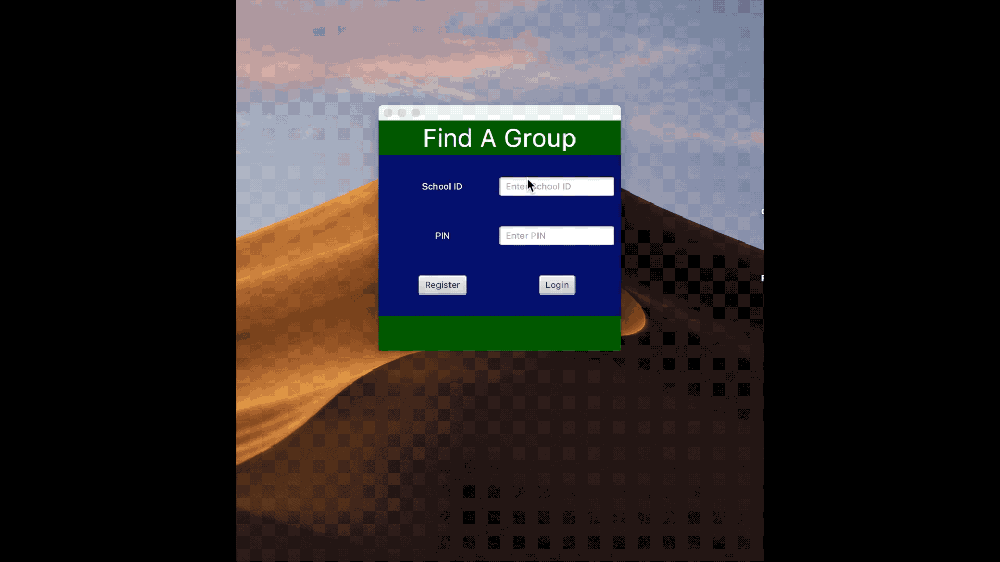
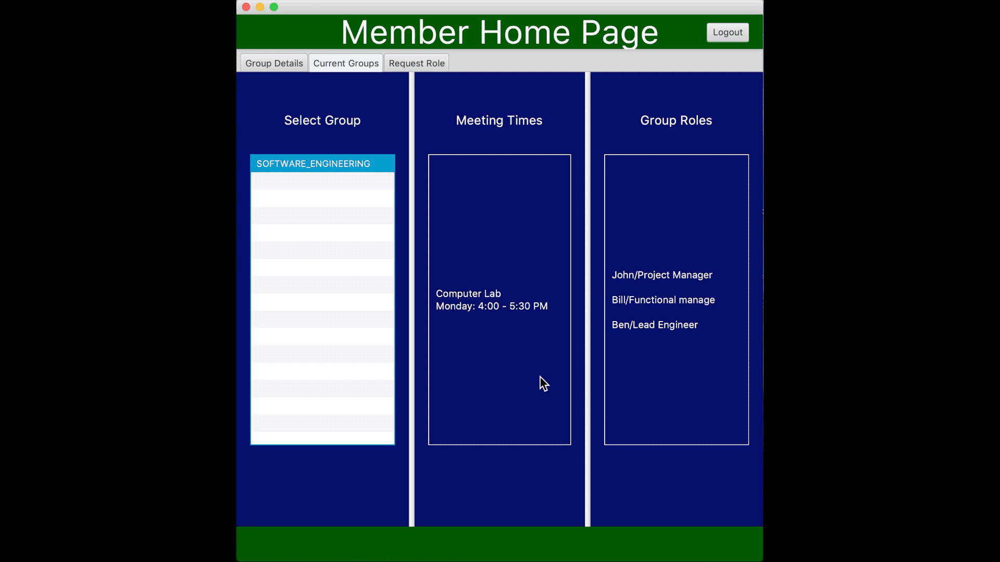
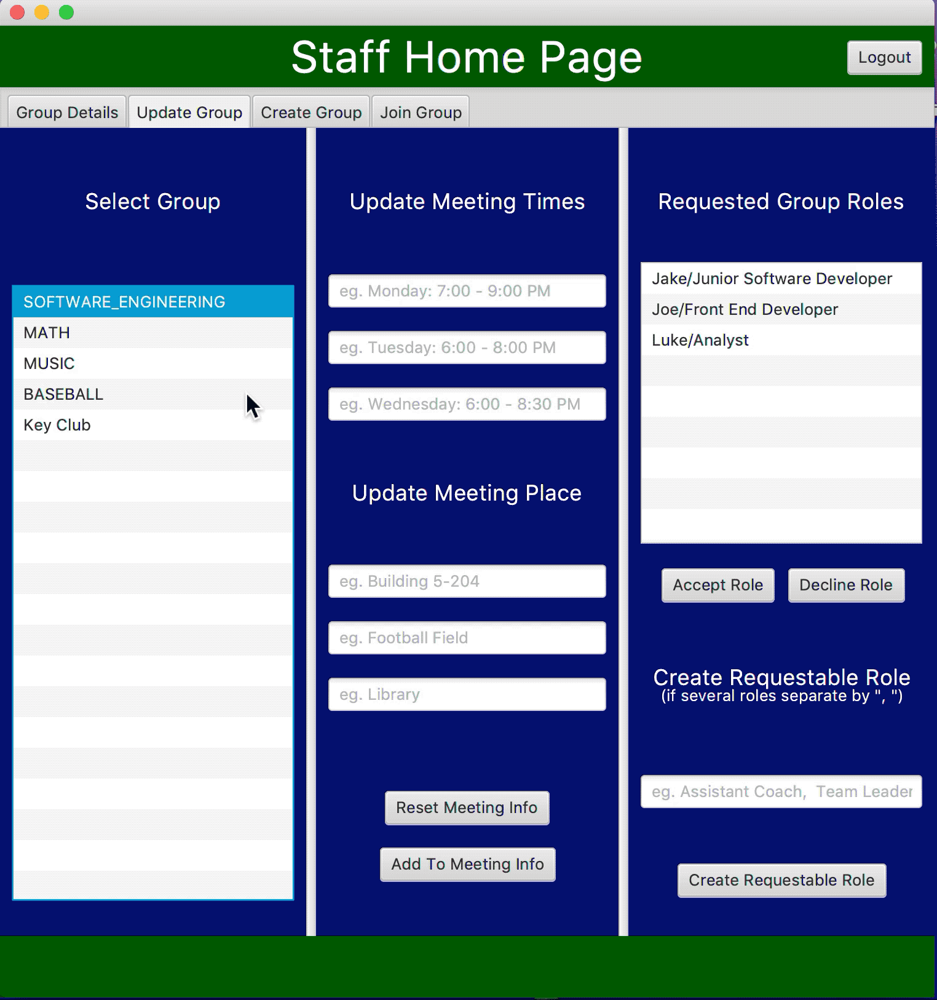

# Find A Group
This program is made for a group of people (such as a school) to organize and inform others about meeting times, places and roles a club/group. Members of Find A Group can view the meeting times, places and roles of the club/group they have joined. Find A Group gives the ability of setting and changing meeting times, places, and roles of a club/group to the staff member(s) of the club/group.

-   **Goals**  (high level intended outcomes; for software)
	- Allow all users to register with a UID and password. When registering the users will be split into two classifications: Member and Staff. The users will also be able to enter the date at witch they will stop needing the program. When this date is reached it will remove the users information from the database.
    -   Allow a member to be able to:
	    - join clubs/groups they are interested in
	    - view the club's/group's meeting times, places and roles that they have joined
	    - request roles for club's/group's they have joined
    -   Allow a staff member to be able to:
	    - join clubs/groups they are interested in
	    - view and edit the club's/group's meeting times and places that they have joined
	    - view, create, and accept the club's/group's roles that they have joined

-   **Design** 
    -   The program is a GUI database program written in Java.
    -   The program is flexible to allow for future expansion.
    -   The program follows best practices for style, documentation, and quality.

-   **Timelines**  
    -   Three 5-week sprints.

## Demonstrations
Register a user

Member join club/group

Member request role

Staff create club/group

Staff update club/group

Staff create role

Staff accept role

## Documentation

[JavaDoc](https://deleuze199.github.io/ProductionLineTracker/javadoc/index.html)

 ## Built With
 
* IntelliJ IDEA  
* SceneBuilder

 ## Author
Benjamin Deleuze

## Acknowledgments

* https://www.w3schools.com/sql/
* Nicholas Hansen helped with css
